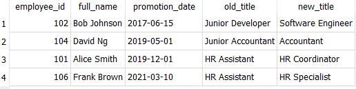
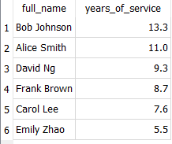

# SQL
HR Analytics SQL Project

This project involves building and querying an employee database to analyze HR trends and workforce metrics. Using SQLite, I created tables for departments, employees, salaries, and promotions. Key analyses include average salary by department, promotion based on date, and employee tenure. The goal is to practice SQL skills while generating (real-world) insights commonly used in HR reporting and decision-making.

Here are a few pictures of the tables I have created:

